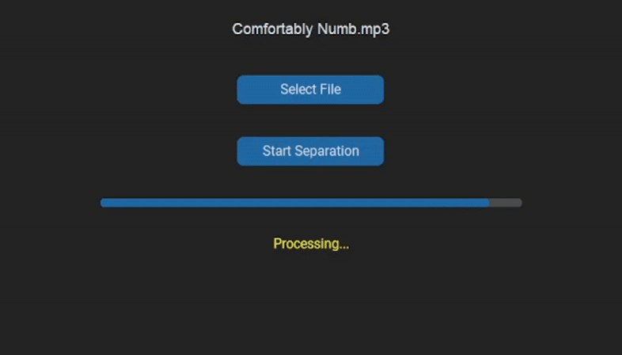

# 🎧 Instrument Separator GUI App

A Python desktop application to **separate instruments (stems)** from music files using [htdemucs_ft](https://github.com/facebookresearch/demucs) model from Demucs. 
Built with a clean and modern UI powered by `customtkinter`, with full audio control using `pygame`.

---

## Features

- Load any `.mp3`, `.wav`, or `.flac` file
- Automatically separate into **vocals, drums, bass, others**
- Choose which stems to keep, delete the rest with a click
- Play/pause stems individually
- Seek & control volume with sliders
- Open output folder directly from the app
- Fully GUI-based, beginner-friendly

---

---

# Installation

## 1. Clone this repository

git clone https://github.com/your-username/instrument-separator.git
cd instrument-separator

## 2. Set up a virtual environment

### With Conda (recommended):

conda create -n stemenv python=3.10
conda activate stemenv

### Or with venv:

python -m venv venv

### Windows:
venv\Scripts\activate
### macOS/Linux:
source venv/bin/activate

## 3. Install dependencies

pip install -r requirements.txt

### Important:
For GPU acceleration, install PyTorch with CUDA from https://pytorch.org/get-started/locally

---

## Running the App
Make sure you’re in the environment and inside the project folder : 

**python main.py**

### Output Location
All separated audio files (stems) are saved under:

outputs/htdemucs_ft/YourSongName/*.wav

- You can open the output folder directly using the 📁 Open Folder button in the app.

# How It Works
**Demucs:** AI model for music source separation (Facebook AI Research)

**subprocess:** Runs Demucs in the background

**pygame:** Handles audio playback, volume, and time control

**customtkinter:** Builds a modern-looking desktop UI

# Requirements

- torch
  
- pygame
  
- customtkinter
  
- demucs

- ffmpeg 
